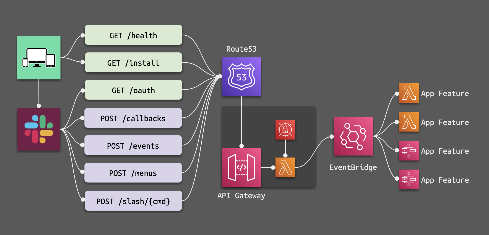

# Serverless Slackbot



[](https://registry.terraform.io/modules/amancevice/slackbot/aws)
[](https://github.com/amancevice/terraform-aws-slackbot/actions)

A simple, serverless, asynchronous HTTP back end for your Slack app.

The application intentionally does very little: it will receive an event from Slack in the form of an HTTP request, verify its origin, publish the payload to EventBridge where it can be processed downstream using [event patterns](https://docs.aws.amazon.com/eventbridge/latest/userguide/eb-event-patterns.html), and finally respond to Slack with an empty `200` OK response.

Adding asynchronous features to your slackbot is as simple as adding the appropriate EventBridge rule/target, and some kind of handler function. See the section on [responding to events asynchronously](#responding-to-events-asynchronously) for details.

In some cases, you may want your Slack app to send a custom, synchronous, response to Slack instead of an empty `200` OK. External select menus and some callbacks, for example, need to respond to Slack with custom data and cannot be processed asyncronously. See the section on [responding to events synchronously](#responding-to-events-synchronously) for details.

> NOTE — Previous versions of this module attempted to be as unopinionated as possible when creating Slackbots.
>
> `v24` takes a more "batteries included" appoach, creating:
> - Regional HTTP API
> - EventBridge event bus
> - SecretsManager secret container
> - Route53 record with regional latency routing configuration

## Example Usage

See the [example](./example) project for detailed usage.

```terraform
data "aws_acm_certificate" "cert" {
  domain = "example.com"
  types  = ["AMAZON_ISSUED"]
}

data "aws_route53_zone" "zone" {
  name = "example.com."
}

module "slackbot" {
  source = "./../.."

  # API GATEWAY
  api_name = "slackbot"

  # DNS
  domain_name            = "slack.example.com"
  domain_certificate_arn = data.aws_acm_certificate.cert.arn
  domain_zone_id         = data.aws_route53_zone.zone.id

  # EVENT BUS
  event_bus_name = "slackbot"

  # LAMBDA
  receiver_function_name  = "slackbot-receiver"
  responder_function_name = "slackbot-responder"
  slack_api_function_name = "slackbot-slack-api"

  # SECRET
  secret_name = "slackbot"

  # CUSTOM RESPONDERS
  custom_responders = {
    "POST /-/callbacks"  = "arn:aws:lambda:us-east-1:123456789012:function:my-callbacks"
    "POST /-/menus"      = "arn:aws:lambda:us-east-1:123456789012:function:my-menus"
    "POST /-/slash/fizz" = "arn:aws:lambda:us-east-1:123456789012:function:my-slash-fizz"
  }

  # TAGS
  tags = {
    # …
  }
}
```

> NOTE — after applying this module you **must** update the SecretsManager secret with the slackbot configuration JSON (all values are optional except where indicated)
>
> Example JSON:
>
> ```json
> {
>   "SLACK_API_TOKEN": "xoxb-xxxx",
>   "SLACK_OAUTH_CLIENT_ID": "xxxx",
>   "SLACK_OAUTH_CLIENT_SECRET": "xxxx",
>   "SLACK_OAUTH_SCOPE": "app_mentions:read chat:write",
>   "SLACK_OAUTH_USER_SCOPE": "",
>   "SLACK_OAUTH_ERROR_URI": "<oauth-error-URI>",
>   "SLACK_OAUTH_REDIRECT_URI": "<oauth-redirect-URI>",
>   "SLACK_OAUTH_SUCCESS_URI": "<oauth-success-URI>",
>   "SLACK_SIGNING_SECRET": "xxxxxxxxxxxxxxxxxxxxxxxxxxxxxxxx", // required
>   "SLACK_SIGNING_VERSION": "v0"
> }
> ```

## HTTP Routes

Endpoints are provided for the following routes:

| Route | Event Published? | Synchronous Support? | Purpose |
|:----- | ----------------:| --------------------:|:------- |
| `GET /health`       |  `No` |  `No` | Healthcheck to ensure your API is functional |
| `GET /install`      |  `No` |  `No` | Helper to begin Slack's OAuth flow |
| `GET /oauth`        | `Yes` |  `No` | Complete Slack's [OAuth2](https://api.slack.com/docs/oauth) workflow (v2) |
| `POST /callbacks`   | `Yes` | `Yes` | Handle Slack's [interactive messages](https://api.slack.com/messaging/interactivity) |
| `POST /events`      | `Yes` |  `No` | Handle events from Slack's [Events API](https://api.slack.com/events-api) |
| `POST /menus`       | `Yes` | `Yes` | Handle [external select menus](https://api.slack.com/reference/block-kit/block-elements#external_select) |
| `POST /slash/{cmd}` | `Yes` | `Yes` | Handle Slack's [slash commands](https://api.slack.com/slash-commands) |

## Responding to Events Synchronously

If you need to respond to Slack with a JSON payload (external select menus, for example), you will need to write an additional lambda function and attach it to the module via the `custom_responses` variable.

The `custom_responses` variable should be a map of API Route Keys => Lambda ARNs. Route Keys _must_ start with `POST /-/` and should match their async counterparts.

Example:

```terraform
module "slackbot" {
  # …

  custom_responses = {
    "POST /-/callbacks"  = "arn:aws:lambda:us-east-1:123456789012:function:my-sync-callbacks"
    "POST /-/menus"      = "arn:aws:lambda:us-east-1:123456789012:function:my-sync-menus"
    "POST /-/slash/fizz" = "arn:aws:lambda:us-east-1:123456789012:function:my-sync-slash-fizz"
  }
}
```

Requests to synchronous endpoints are signed using [AWS Signature v4](https://docs.aws.amazon.com/general/latest/gr/signature-version-4.html) and forwarded to the `/-/*` equivalent. By Default these requests are captured by the `POST /-/{proxy+}` route and respond with a `200` OK response. Adding your own custom responses override this behavior.

See the [example](./example) project for usage.

## Responding to Events Asynchronously

EventBridge events are discoverable using [event patterns](https://docs.aws.amazon.com/eventbridge/latest/userguide/eb-event-patterns.html). Filter events using a bus name, source value, detail-type, or even parts of the event payload.

The following table shows the mapping of route-to-detail-type:

| Route               | Event Bus         | Source             | Detail Type     |
| :------------------ |:----------------- |:------------------ |:--------------- |
| `GET /oauth`        | `<your-bus-name>` | `oauth`            | `install`       |
| `POST /callbacks`   | `<your-bus-name>` | `<callback_type>`  | `<callback_id>` |
| `POST /events`      | `<your-bus-name>` | `event_callback`   | `<event_type>`  |
| `POST /menus`       | `<your-bus-name>` | `block_suggestion` | `<callback_id>` |
| `POST /slash/{cmd}` | `<your-bus-name>` | `slash_command`    | `/<command>`    |

### Example Event Patterns

In order to process a given event you will need to create an EventBridge rule with a pattern that targets a specific event.

The following examples show how a subscription might me made in Terraform:

#### Callbacks

```terraform
resource "aws_cloudwatch_event_rule" "block_actions" {
  # …
  event_pattern = jsonencode({
    source      = ["block_actions"]
    detail-type = ["my_action_id"]
  })
}
```

```terraform
resource "aws_cloudwatch_event_rule" "view_submission" {
  # …
  event_pattern = jsonencode({
    source      = ["view_submission"]
    detail-type = ["my_callback_id"]
  })
}
```

#### Event

```terraform
resource "aws_cloudwatch_event_rule" "app_home_opened" {
  # …
  event_pattern = jsonencode({
    source      = ["event_callback"]
    detail-type = ["app_home_opened"]
  })
}
```

#### OAuth

```terraform
resource "aws_cloudwatch_event_rule" "oauth" {
  # …
  event_pattern = jsonencode({
    source      = ["oauth"]
    detail-type = ["install"]
  })
}
```

#### Slash Command

```terraform
resource "aws_cloudwatch_event_rule" "slash" {
  # …
  event_pattern = jsonencode({
    source      = ["slash_comand"]
    detail-type = ["/my-command"]
  })
}
```
