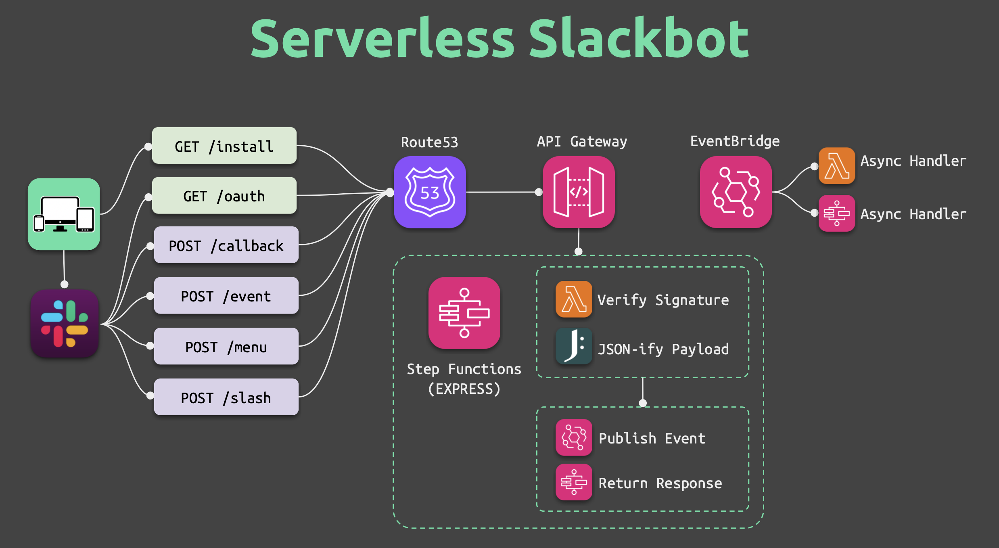

# Serverless Slackbot



[](https://registry.terraform.io/modules/amancevice/slackbot/aws)
[](https://github.com/amancevice/terraform-aws-slackbot/actions/workflows/test-validate.yml)

[](https://ko-fi.com/smallweirdnumber)

A simple, serverless back end for your Slack app.

> ⚠️ NOTE — `v25` of this module is a complete architectural redesign and is not compatible with previous versions.

## Use Case

The application intentionally does very little, leaving room for you to customize your app.

Out of the box, it will:

- Receive an event from Slack in the form of an HTTP request
- Verify the request's signature headers
- Publish the JSON-ified payload to EventBridge where it can be processed asynchronously
- And, finally, send a response back to Slack (usually an empty 200)

Adding asynchronous features to your slackbot is as simple as adding the appropriate EventBridge rule/target, and some kind of handler function. See the section on [responding to events asynchronously](#responding-to-events-asynchronously) for details. See the [EventBridge documentation](https://docs.aws.amazon.com/eventbridge/latest/userguide/eb-event-patterns.html) for more info on event pattern matching.

In some cases, you may want your Slack app to send a custom, synchronous, response to Slack instead of an empty `200` OK. External select menus and some callbacks, for example, need to respond to Slack with custom data and cannot be processed asyncronously. See the section on [responding to events synchronously](#responding-to-events-synchronously) for details.

## Prerequisites

Before applying this module you should have created the following resources:

- Route53 Hosted Zone (eg, `example.com`)
- An available subdomain for your app's REST API (eg, `slack.example.com`)
- ACM Certificate covering your app's subdomain (eg, `*.example.com`, `slack.example.com`)
- A [Slack App](https://api.slack.com/apps) with a signing secret, OAuth client keys, and a default web API token

## Example Usage

See the [example](./example) project for detailed usage.

```terraform
data "aws_acm_certificate" "cert" {
  domain = "example.com"
  types  = ["AMAZON_ISSUED"]
}

data "aws_route53_zone" "zone" {
  name = "example.com."
}

module "slackbot" {
  source  = "amancevice/slackbot/aws"
  version = "~> 25.0"

  # App Name
  name = "slackbot"

  # DNS
  domain_name            = "slack.example.com"
  domain_certificate_arn = data.aws_acm_certificate.cert.arn
  domain_zone_id         = data.aws_route53_zone.zone.id

  # SLACK
  slack_client_id      = var.slack_client_id
  slack_client_secret  = var.slack_client_secret
  slack_error_uri      = "https://example.com/slack/error.html"
  slack_scope          = "app_mentions:read,chat:write"
  slack_signing_secret = var.slack_signing_secret
  slack_success_uri    = "slack://app?team={TEAM_ID}&id={APP_ID}"
  slack_user_scope     = ""
  slack_token          = var.slack_token

  # TAGS
  tags = {
    # ...
  }
}
```

## HTTP Routes

Endpoints are provided for the following routes:

| Route            | Event Published? | Custom Response? | Purpose                                                                                                  |
| :--------------- | ---------------: | ---------------: | :------------------------------------------------------------------------------------------------------- |
| `GET /install`   |             `No` |             `No` | Helper to begin Slack's OAuth flow                                                                       |
| `GET /oauth`     |            `Yes` |             `No` | Complete Slack's [OAuth2](https://api.slack.com/docs/oauth) workflow (v2)                                |
| `POST /callback` |            `Yes` |            `Yes` | Handle Slack's [interactive messages](https://api.slack.com/messaging/interactivity)                     |
| `POST /event`    |            `Yes` |             `No` | Handle events from Slack's [Events API](https://api.slack.com/events-api)                                |
| `POST /menu`     |            `Yes` |            `Yes` | Handle [external select menus](https://api.slack.com/reference/block-kit/block-elements#external_select) |
| `POST /slash`    |            `Yes` |            `Yes` | Handle Slack's [slash commands](https://api.slack.com/slash-commands)                                    |

## Responding to Events Synchronously

For some events (external select menus, for example) you will need to respond to Slack with a JSON payload.
This can be accomplished by deploying a specially named Lambda function that returns a proxy-like response.

When your app receives an event that supports a synchronous response it will attempt to call a Lambda function with the naming convention:

```plaintext
<your-app-name>-<slack-event-type>
```

This function should return a JSON object with `statusCode` and `body` fields.
The `statusCode` field should be `200` and the `body` field should be the response payload encoded as a JSON string.

### Example Synchronous Function

The following Python block is a crude example of a Lambda function that provides options for an external menu:

```python
import json

def handler(event, _):
    return {
        "statusCode": 200,
        "body": json.dumps({
            "options": [
                {"value": "option1", "text": {"type": "plain_text", "text": "Option 1"}},
                {"value": "option2", "text": {"type": "plain_text", "text": "Option 2"}},
                {"value": "option3", "text": {"type": "plain_text", "text": "Option 2"}},
            ]
        }),
    }
```

Assuming our app is named `slackbot` we would then deploy this function with the name `slackbot-block_suggestion` since it is intended to be invoked for Slack events with the type of `block_suggestion`.

See the [example](./example) project for more advanced usage.

## Responding to Events Asynchronously

EventBridge events are actionable through [event patterns](https://docs.aws.amazon.com/eventbridge/latest/userguide/eb-event-patterns.html).
You can filter events using a bus name, source value, detail-type, and even parts of the event payload.

The following table shows the mapping of route-key : event

| Route Key        | Event Bus    | Source          | Detail Type      |
| :--------------- | :----------- | :-------------- | :--------------- |
| `GET /oauth`     | `<your-app>` | `<your-domain>` | `GET /oauth`     |
| `POST /callback` | `<your-app>` | `<your-domain>` | `POST /callback` |
| `POST /event`    | `<your-app>` | `<your-domain>` | `POST /event`    |
| `POST /menu`     | `<your-app>` | `<your-domain>` | `POST /menu`     |
| `POST /slash`    | `<your-app>` | `<your-domain>` | `POST /slash`    |

### Example Event Patterns

In order to process a given event you will need to create an EventBridge rule with a pattern that targets a specific event.

The following examples show how a subscription might me made in Terraform:

#### Callbacks

```terraform
resource "aws_cloudwatch_event_rule" "block_actions" {
  event_bus_name = "<your-app>"
  # …

  event_pattern = jsonencode({
    source      = ["<your-domain>"]
    detail-type = ["POST /callback"]
    detail = {
      type = ["block_actions"]
      actions = {
        action_id = ["your_action_id"]
      }
    }
  })
}
```

```terraform
resource "aws_cloudwatch_event_rule" "view_submission" {
  event_bus_name = "<your-app>"
  # …

  event_pattern = jsonencode({
    source      = ["<your-domain>"]
    detail-type = ["POST /callback"]
    detail = {
      type = ["view_submission"]
      view = {
        callback_id = ["your_view_callback_id"]
      }
    }
  })
}
```

#### Event

```terraform
resource "aws_cloudwatch_event_rule" "app_home_opened" {
  event_bus_name = "<your-app>"
  # …

  event_pattern = jsonencode({
    source      = ["<your-domain>"]
    detail-type = ["POST /callback"]
    detail = {
      type = ["event_callback"]
      event = {
        type = ["app_home_opened"]
      }
    }
  })
}
```

#### OAuth

```terraform
resource "aws_cloudwatch_event_rule" "oauth" {
  event_bus_name = "<your-app>"
  # …

  event_pattern = jsonencode({
    source      = ["<your-domain>"]
    detail-type = ["GET /oauth"]
  })
}
```

#### Slash Command

```terraform
resource "aws_cloudwatch_event_rule" "slash" {
  event_bus_name = "<your-app>"
  # …

  event_pattern = jsonencode({
    source      = ["<your-domain>"]
    detail-type = ["POST /slash"]
    detail = {
      type    = ["slash_command"]
      command = ["/your-command"]
    }
  })
}
```
